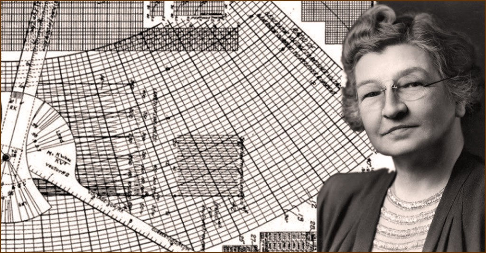
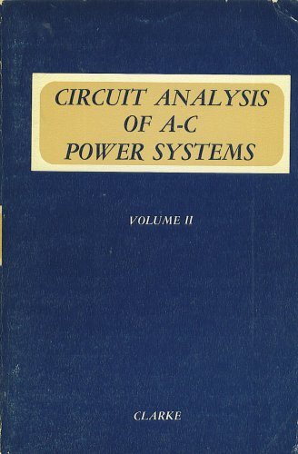

A eletricidade tem fundamental importância para a ascenção tecnológica e está presente nos ambientes mais básicos e essenciais no desenvolvimento humano, sendo algo que acompanha e que está ligada diretamente ao mundo que conhecemos hoje, dessa forma, a importância do engenheiro elétrico aponta para um longo tempo de história e de desenvolvimento...

...nesse contexto, podemos citar **Edith Clarke** como peça importante e que contribuiu ativamente com esse processo.

> "Edith Clarke foi a primeira engenheira eletricista e primeira professora de engenharia elétrica da Universidade do Texas em Austin."

{:.center bordered}

{:.center}
Edith Clarke

Edith Clarke nasceu no Condado de Howard no estado americano de Maryland, e, apesar de apresentar algumas dificuldades de aprendizado com a leitura e a ortografia ela demonstrou grande aptidão pela matemática e por jogos de carta. Edith foi criada por um tio por um período curto de tempo e posteriormente estudou em um internato até 1899.

Apesar do contexto do século vinte se apresentar como ***desafiador*** para as mulheres na área da engenharia, Edith escolheu dar continuidade aos estudos e utilizou a herança deixada pelos pais ao completar dezoito anos  de idade, inscrevendo-se no Vassar College em Nova York.

> Edith Clarke se forma em 1908 de forma destacável e com uma chave para a sociedade Phi Beta Kappa

**Phi Beta Kappa** é uma sociedade de honra academica dos Estados Unidos da América. 

"Tem como objetivo promover e defender a excelência nas artes liberais e ciências bem como doutrinar os alunos destas áreas que **se destacam nas faculdades e universidades norte-americanas**." A seguir uma representação do símbolo da Phi Beta Kappa:

{:.center bordered}

 

> Ser listada pela Phi Beta Kappa mostra o comprometimento de Edith com seus estudos.

Após a sua formatura, Edith ensinou matemática e física em uma escola particular em São Francisco e passou um pequeno tempo estudando engenharia civil em 1911, durante as férias do primeiro período em 1912 ela trabalhou como "Computador", era comum que ***mulheres*** com boa base de matemática trabalhassem
executando cálculos para pesquisadores ou empresas. A seguir um exemplo de funcionárias que trabalhavam como "Computadores humanos".

{:.center bordered}

{:.center}
Computer assistants

Nesse momento Edith demonstrava o seu potencial e na AT&T ficou fascinada com conceitos como circuitos elétricos e linhas de transmissão, decidindo abandonar a Engenharia Civil e seguir com **Engenharia Elétrica no MIT**, Edith se graduou em 1918 e continou o mestrado por mais um ano se tornando a **primeira mulher** a se graduar em Engenharia Elétrica na instituição.

Um dos maiores feitos realizados por Edith foi a **calculadora Clarke** em 1921. O propósito da calculadora era de facilitar
a análise de linhas de transmissão reduzindo o procedimento de cálculos em até **dez vezes**. A patente foi aprovada em Setembro de 1925.

{:.center bordered}

{:.center}
Calculadora Clarke

Em 1943, o livro **“Circuit Analysis of A-C Power Systems”** foi publicado, as notas de aula na General Electric foram a base para sua obra que foi muito utilizada em cursos de engenharia.

{:.center bordered}

{:.center}
Circuit Analysis of A-C Power Systems

### Alguns feitos destacáveis ...
 

- Em 1918, Clarke foi a primeira mulher a conquistar um certificado de M.S. (Master of Science) em Engenharia Elétrica pelo MIT.
- Foi a primeira mulher a entregar um artigo do Instituto Americano de Engenheiros Eletricistas, na reunião anual. Mostrou o uso de funções hiperbólicas para calcular a potência máxima que uma linha poderia carregar sem instabilidade. Além disso foi a primeira mulher a se tornar membro do Instituto em 1948.
- Em 1954 recebeu o Society of Women Engineeers Achievement Award.
- Em 2015, Clarke entrou postumamente para o Hall da Fama de Inventores Nacionais
- Em 1954 as realizações de Edith foram reconhecidas pela Society of Women Engineers Achievements Award “em reconhecimento de suas muitas contribuições originais para a teoria de estabilidade e análise de circuitos.”

**Edith Clark** foi uma **mulher** de grande importância para engenharia, ela acreditava que existia demanda para bons trabalhos ...

> ”Não existe uma demanda para mulheres engenheiras, da mesma forma como não existe para médicas mulheres; mas sempre existe uma demanda para aqueles que conseguem fazer um bom trabalho” - Edith Clarke

### Referências

[Biografia de Edith Clarke](https://energiainteligenteufjf.com.br/biografia/biografia-edith-clarke/)
 
[Primeira engenheira eletricista professora](https://inbec.com.br/blog/edith-clarke-primeira-engenheira-eletricista-professora-engenharia-eletrica-mundo)
 
[Edith Clarke](https://pt.wikipedia.org/wiki/Edith_Clarke)

 

<!-- autor -->

<h3 class="post-title">Autor</h3> 

  

    <table class="table-borderless highlight">
      <thead>
        <tr>
          <th></th>
        </tr>
      </thead>
      <tbody>
        <tr class="font-weight-bolder" style="text-align: center margin-top: 0">
          <td>Anderson Lima</td>
        </tr>
        <tr style="text-align: center" >
          <td style="color: #808080; vertical-align: top; text-align: justify"><small>Pesquisador em Robótica no Centro de Competências em Robótica e Sistemas Autônomos do Senai Cimatec. Anderson é formado em engenharia civil. Exerce atualmente a função de pai 24 horas.</small></td>
          <td></td>
        </tr>
      </tbody>
    </table>
  

 